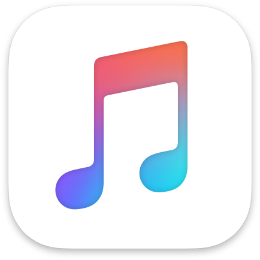

# iTunes Podcast Finder



iTunes Podcast Finder is a .NET Standard 2.0 library that allows you to search for podcasts through the iTunes API and get episodes of podcasts from the RSS feed. Get the [Nuget package](https://www.nuget.org/packages/Luandersonn.iTunesPodcastFinder/).

```cmd
PM> Install-Package Luandersonn.iTunesPodcastFinder
```

## Features

- [Search podcasts from iTunes](#search)
- [Get the list of the most popular podcasts by country and genre](#get-top-podcasts)
- [Get podcast by iTunes ID](#get-a-podcast-by-itunes-id)
- [Get podcast and episodes from the RSS feed URL](#get-podcasts-and-episodes-by-rss-feed-link)

## Usage

```C#
PodcastFinder finder = new PodcastFinder();
```

### Search
```C#
// Default: retrieve 100 items using the US search
IEnumerable<Podcast> results = await finder.SearchPodcastsAsync("Games");
foreach (Podcast podcast in results)
{
    Debug.WriteLine($"Name = {podcast.Name}");
    Debug.WriteLine($"Editor = {podcast.Editor}");
    Debug.WriteLine($"Genre = {podcast.Genre}");
}		
```

#### Optimized search for another country

```C#
int maxItems = 30; // Min:1 - max:200
string country = "br" // Two-letter country code (ISO 3166-1 alpha-2)

// Results optimized for Brazil
IEnumerable<Podcast> results = await finder.SearchPodcastsAsync("Games", maxItems, country);
foreach (Podcast podcast in results)
{
    Debug.WriteLine($"Name = {podcast.Name}");
    Debug.WriteLine($"Editor = {podcast.Editor}");
    Debug.WriteLine($"Genre = {podcast.Genre}");
}
```	

### Get top podcasts

```C#
// Get the 100 most popular podcasts from the US in Games & Hobbies category
IEnumerable<Podcast> results = await finder.GetTopPodcastsAsync(PodcastGenre.GamesAndHobbies);
foreach (Podcast podcast in results)
{
    Debug.WriteLine($"Name = {podcast.Name}");
    Debug.WriteLine($"Editor = {podcast.Editor}");
    Debug.WriteLine($"Genre = {podcast.Genre}");
}
```	
> :exclamation: WARNING: In this method, the resolution of the art images of the podcasts is 170x170 and the feedUrl is null, this is a behavior of the iTunes API!. To get better resolution images and feedUrl, use the `GetPodcastAsync` method with the iTunes ID

### Get a podcast by iTunes ID

```C#
string iTunesID = "1200361736"; // ID from 'The Daily' Podcast

Podcast podcast = await finder.GetPodcastAsync(iTunesID);

Debug.WriteLine($"Name = {podcast.Name}");      // The Daily
Debug.WriteLine($"Editor = {podcast.Editor}");	// The New York Times
Debug.WriteLine($"Genre = {podcast.Genre}");    // News & Politics
```	
~~You can get the iTunes ID with the pocast link from iTunes using the static method `PodcastFinder.GetItunesID(iTunesLink)`~~
Podcast class now has iTunesId property.

```C#
IEnumerable<Podcast> brazilTopPodcasts = await finder.GetTopPodcastsAsync(PodcastGenre.All, 50, "br");
Podcast mostPopularPodcast = brazilTopPodcasts.First();

Podcast podcast = await finder.GetPodcastAsync(mostPopularPodcast.ItunesId);

Debug.WriteLine($"Name = {podcast.Name}");
Debug.WriteLine($"Editor = {podcast.Editor}");
Debug.WriteLine($"Genre = {podcast.Genre}");	
```

### Get podcasts and episodes by RSS feed link
If you have a RSS feed URL of a podcast and want to get the episodes...

```C#
string feedUrl = "http://rss.art19.com/the-daily";
PodcastRequestResult result = await finder.GetPodcastEpisodesAsync(feedUrl);

Debug.WriteLine($"Podcast name = {result.Podcast.Name}");
foreach (PodcastEpisode episode in result.Episodes)
{
    Debug.WriteLine($"Episode number = {episode.EpisodeNumber}");
    Debug.WriteLine($"Title = {episode.Title}");
    Debug.WriteLine($"Summary = {episode.Summary}");
    Debug.WriteLine($"Published Date = {episode.PublishedDate}");
    // In some cases, the duration is not reported by the RSS feed.
    // In these scenarios, the 'Duration' value is "00:00:00"
    Debug.WriteLine($"Duration = {episode.Duration}");
}
```	
### Dependencies

[Newtonsoft.Json 12.0.2](https://github.com/JamesNK/Newtonsoft.Json)
